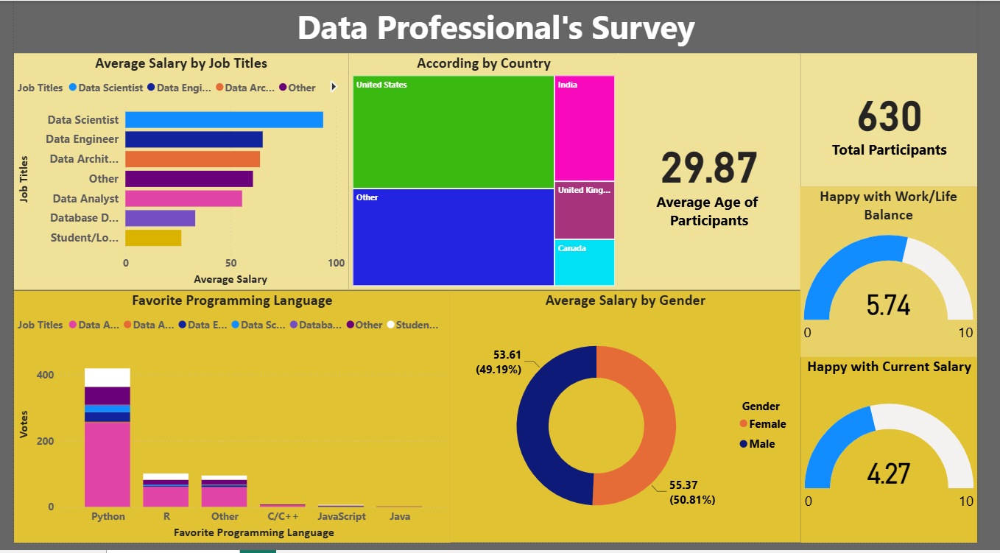

# Data Professional Survey Performance Analysis (Power BI)

## Project Overview
This project leverages Power BI Desktop to build an interactive, executive-level business intelligence reporting platform using international survey feedback from active working data professionals. The end-to-end application maps raw survey string data into a clean data model, handles structured string breakdowns via Power Query, and builds custom DAX calculations to evaluate modern workforce trends.

## Dashboard Preview
The application interface uses a high-contrast theme to highlight global workforce metrics, developer compensation baselines, and programming language popularity rankings.

## Core Business Questions Addressed
The reporting tier isolates key parameters affecting the modern data ecosystem:
1. **Compensation Benchmarks:** What is the average take-home salary distribution across distinct country boundaries and specific data job titles?
2. **Tooling Adaptability:** Which programming languages dominate actual developer workspaces based on practical usage?
3. **Entry Barriers:** How heavily does historical work experience or academic background correlate with achieving higher financial tiers?
4. **Work-Life Balance Indices:** How do employees grade their workspace happiness levels based on work-from-home vs. in-person company requirements?

## Technical Competencies Demonstrated
* **Advanced Power Query ETL:** Executed text splitting on complex multi-choice columns, filtered out out-of-bounds salary limits, and handled extensive null value formatting.
* **Star Schema Data Modeling:** Implemented a structured relationship matrix linking data dimension categories cleanly to main response keys.
* **DAX Measure Engineering:** Formatted custom calculated variables and counts to display clean, real-time averages across active report slicers.
* **UI/UX Visual Hierarchy:** Configured a minimalist user interface grouping related workforce categories logically with responsive filtering sliders.

## Repository Contents
* `Power BI Project Dataset.xlsx`: The raw survey data ledger source file containing developer responses.
* `Data_Professional.pbix`: The completed Power BI application workbook featuring the data model, Power Query steps, and interactive visuals.
* `Screenshot 2026-06-27 081145.png`: High-resolution dashboard screenshot used for repository documentation.
* `README.md`: Project summary and portfolio documentation.
